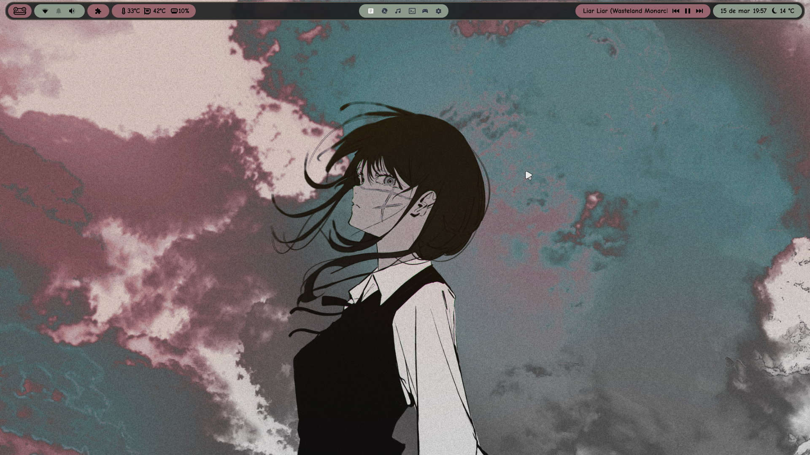
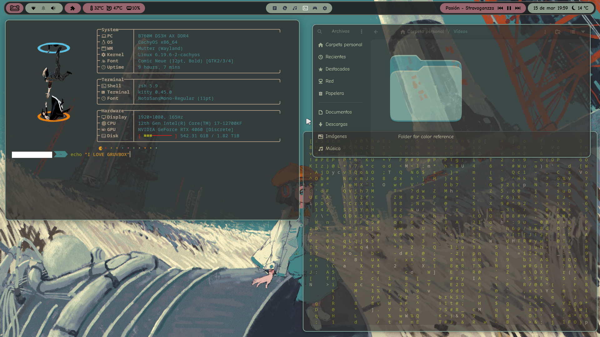
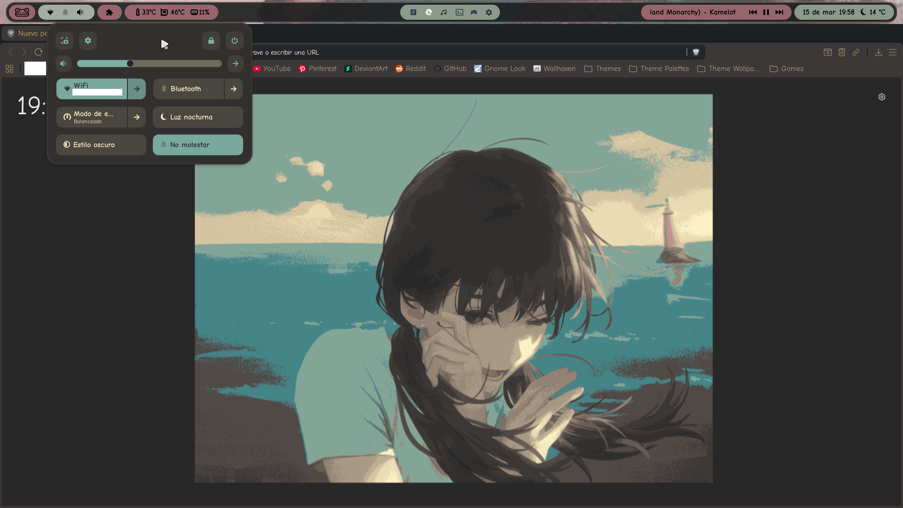
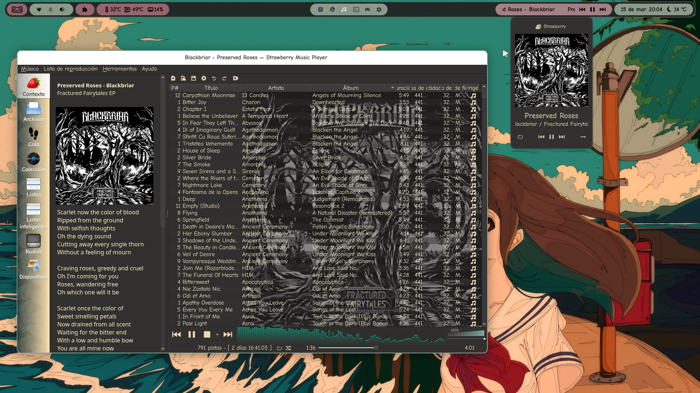
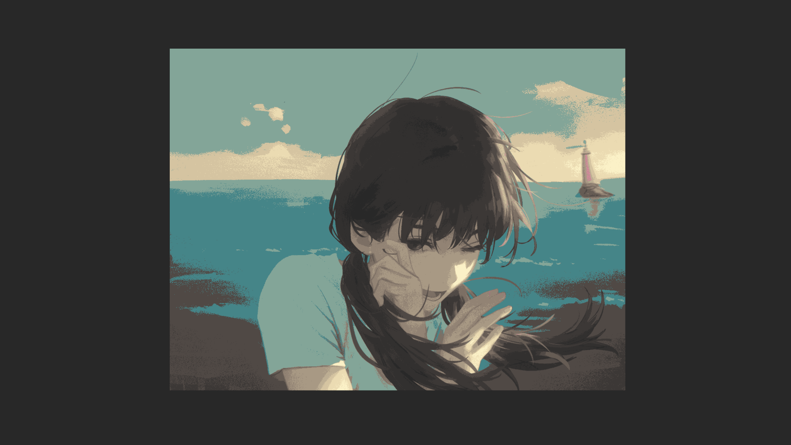
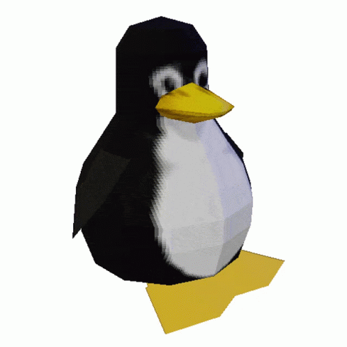

# Gruvbox Gnome Guide

A comprehensive guide for ricing with Gruvbox theme as a base.

## Features

- Easy installation instructions
- Full customization guide
- Extensions that are useful
- GNOME customization tips


## Visual Examples

**Desktop:**


**Terminal:**


**Files and Brave:**


**Music:**


---

## Before installing the theme

Install all necessary components so the theme works:

### Installation Commands by Distribution

| Package | Ubuntu/Debian | Arch/Manjaro | Fedora |
|---------|---------------|--------------|--------|
| **GNOME Tweaks** | `sudo apt install gnome-tweaks` | `sudo pacman -S gnome-tweaks` | `sudo dnf install gnome-tweaks` |
| **Extensions Manager** | `sudo apt install gnome-extensions-app` | `sudo pacman -S gnome-extensions-app` | `sudo dnf install gnome-extensions-app` |

### User Themes Extension

1. Open GNOME Extensions Manager
2. Search for "User Themes"
3. You can Install from: https://extensions.gnome.org/extension/19/user-themes/

### Create Required Folders

Create these folders in your home directory (if not created previously):

```bash
mkdir -p ~/.themes
mkdir -p ~/.icons
```

---

## Installation

### Installing the GTK Theme

**Theme:** https://github.com/Fausto-Korpsvart/Gruvbox-GTK-Theme

#### Steps:

1. Clone or download the repository:
```bash
git clone https://github.com/Fausto-Korpsvart/Gruvbox-GTK-Theme.git
cd Gruvbox-GTK-Theme-master/themes
```
2. Run the installation script:
```bash
./install.sh
```
3. Choose your preferred settings when prompted (Follow official GitHub guide):
- Color Schemes: Medium or Soft
- Tone: Dark or Light
- Accent Color: Choose your preferred accent

4. **Important:** Add the `-l` flag to link the theme to libadwaita apps:
```bash
./install.sh -l
```

5. Apply the theme in GNOME Tweaks:
- Open GNOME Tweaks
- Go to Appearance → Themes
- Select your installed Gruvbox theme

**Note:** Sometimes you need to log out and log in to see the changes. 

### Installing Icon Pack

**Icons:** Gruvbox Plus Icons (https://www.gnome-look.org/p/1961046) or any icon pack from https://www.gnome-look.org

#### Steps:
1. Download your preferred icon pack
2. Extract to the `.icons` folder
3. Apply the icons in GNOME Tweaks:
- Open GNOME Tweaks
- Go to Appearance → Icons
- Select your preferred icon theme


### Installing the Cursor Theme

**Cursor:** Any cursor from https://www.gnome-look.org

#### Steps:
1. Download your preferred cursor pack (The one I use: https://www.gnome-look.org/p/1346778)
2. Extract to the `.icons` folder
3. Apply the cursor in GNOME Tweaks:
- Open GNOME Tweaks
- Go to Appearance → Cursors
- Select your downloaded cursor theme

### Installing the fonts

**Fonts:** Any font from https://fonts.google.com/ or use the already installed ones

#### Steps:
1. Download your preferred font (The one I use: https://fonts.google.com/specimen/Comic+Neue)
2. Extract to the fonts folder:
```bash
mkdir -p ~/.local/share/fonts
unzip font-name.zip -d ~/.local/share/fonts
```
3. Refresh the font cache:
```bash
fc-cache -fv
```
4. Apply the font in GNOME Tweaks:
- Open GNOME Tweaks
- Go to fonts
- Select your downloaded font

---

## Extensions

To enhance your Gruvbox rice, you'll need extensions. You can search here: https://extensions.gnome.org/

The ones I recommend/use are listed below, but don't forget to explore and find the ones you like:

### Blur My Shell:

**Link:** https://extensions.gnome.org/extension/3193/blur-my-shell/

**Description:** It blurs many apps, menus, and the shell itself. Visually beautiful.

**Recommended Configuration:**

#### Panel Blur
- **Status:** Off

#### General View
- **Background Blur:** On
- **Flux:** Default
- **Style:** Light
- **Folder Blur:** On
- **Sigma:** 30
- **Brightness:** 0.60

#### Dialogs
- **Transparent:** On

#### Dash to Dock
- **Status:** Off

#### Apps
- **Status:** On
- **Sigma:** 10
- **Brightness:** 1
- **Opacity:** 200
- **Focused Opaque App:** On
- **General View Blur:** On
- **Activate All by Default:** On

---

### Extension List:

**Link:** https://extensions.gnome.org/extension/3088/extension-list/

**Description:** It shows a puzzle piece icon in the top bar so you can see and manage extensions without opening the Extensions Manager app.

---

### Logo Menu:

**Link:** https://extensions.gnome.org/extension/4451/logo-menu/

**Description:** It shous a logo in the top bar with many functions, as open the terminal. I actually don't use it, only for decoration haha

---

### Media Controls

**Link:** https://extensions.gnome.org/extension/4470/media-controls/

**Description:** Media player controls displayed in the top bar showing what you're currently listening to. Super useful for studying or working without having to switch to the music player app.

---

### Open Bar

**Link:** https://extensions.gnome.org/extension/6580/open-bar/

**Description:** Extension for customizing the top bar. The colors in the preview images are thanks to this extension.


**My Configuration:**

*(Options not listed are left at default)*

#### Top Bar Properties
- **Type of Bar:** Floating
- **Bar Height:** 40
- **Bar Margins:** 4
- **Bottom Bar Margins:** 3
- **Apply in Overview:** Off

#### Bar Foreground
- **Auto FG Color:** Off
- **FG Color:** #000000
- **FG Alpha:** 1
- **Panel Font:** Comic Neue Bold 12

#### Bar Background
- **Box/Margins Alpha:** 0
- **Bar BG Color:** #1D2021
- **Bar BG Alpha:** 0,90
- **Apply Candy Bar palette:** On
- **Candy Bar Colors I use:** Red: #A46C74 and Blue/green: #97A697
- **Candy BG Alpha:** 0,90
- **Panel Shadow:** Off

#### Bar Border
- **Width:** 2,0
- **Apply Width to:** ALL
- **Corner Radius:** 20
- **Apply Radius to:** ALL
- **Color:** #928374
- **Alpha:** 0,6
- **Neon Glow:** Off

#### Popus Menus
- **Enable Menu Styles:** Off


**Note:** To customize your palette's background and bar colors, you can use the "Auto-Theming" feature. This will automatically generate a color scheme that matches your current wallpaper.

---

### Space Bar

**Link:** https://extensions.gnome.org/extension/5090/space-bar/

**Description:** Allows you to customize the workspace bar with custom characters and styling.

**Characters:** I use Roman numerals or dice, but you can use whatever you want. Search for characters here: https://emojidb.org/

**Recommended Configuration:**

#### Behavior
- **Indicator Style:** Workspaces bar
- **Position in top Panel:** Center
- **Show Empty Workspaces:** On
- **Toggle Overview:** On

#### Appearance
- **Workspaces-bar Padding:** 10
- **Workspace Margin:** 2

#### Active Workspace
- **Background Color:** Invisible (Choose the fully invisible option in custom colors)
- **Text Color:** #FFFFFF
- **Border Color:** Invisible
- **Font Size:** 14-16 (Some special characters may not respond to this setting)
- **Font Weight:** Extra Bold
- **Horizontal Padding:** 10
- **Vertical Padding:** 0

#### Inactive Workspace
- **Background Color:** Invisible
- **Text Color:** #303446
- **Border Color:** Invisible


#### Empty Workspace
- **Background Color:** Invisible
- **Text Color:** #303446
- **Border Color:** Invisible

---

### Top Bar Organizer

**Link:** https://extensions.gnome.org/extension/4356/top-bar-organizer/

**Description:** Allows you to reorder and customize the items displayed in the top bar.

**My Configuration:**

#### Left
- **Logo Menu**
- **Quick Settings**
- **Extension List**
- **Vitals**

#### Center
- **Activities**
- **Space Bar**

#### Right
- **Media Controls**
- **Date Menu**

---

### Vitals

**Link:** https://extensions.gnome.org/extension/1460/vitals/

**Description:** Shows useful system information in the top bar such as GPU/CPU temperatures, system usage, memory, and more.

---

### Weather O'Clock

**Link:** https://extensions.gnome.org/extension/5470/weather-oclock/

**Description:** Displays the weather next to the clock in the top bar. Requires GNOME Weather to be installed.

**Install GNOME Weather:**

| Distribution | Command |
|---|---|
| Ubuntu/Debian | `sudo apt install gnome-weather` |
| Arch/Manjaro | `sudo pacman -S gnome-weather` |
| Fedora | `sudo dnf install gnome-weather` |

---

## Additional Resources

The core configuration is complete! You can find the specific assets and configuration files for each component below:

## 🏞️ Wallpapers Preview: [Explore the gallery](./Wallpapers)

| | | | |
| :---: | :---: | :---: | :---: |
|  |  |  |  |
| **Gruvbox 1** | **Gruvbox 2** | **Gruvbox 3** | **Gruvbox 4** |
|  |  |  |  |
| **Gruvbox 5** | **Gruvbox 6** | **Gruvbox 7** | **Gruvbox 8** |

---

## 🎮 Steam Themes Guide

To make Steam match your GNOME desktop perfectly, we’ll use the **Adwaita-for-Steam** skin. This allows you to apply themes like Gruvbox or Catppuccin to the Steam client.

All resources and detailed documentation can be found at the official site: https://github.com/tkashkin/Adwaita-for-Steam
## Installation

1. Clone or download the repository:
```bash
git clone https://github.com/tkashkin/Adwaita-for-Steam
cd Adwaita-for-Steam
./install.py
```

2. List Options
```bash
./install.py -l
```

3. Install Customizations (Example)
```bash
./install.py -c gruvbox -e library/hide_whats_new
```

## Preview


---

## Kitty Terminal Customization

To give your terminal a polished and professional look, follow these steps:

### 🐱 Kitty Installation

| Package | Ubuntu/Debian | Arch/Manjaro | Fedora |
|---------|---------------|--------------|--------|
| **Kitty** | `sudo apt install kitty` | `sudo pacman -S kitty` | `sudo dnf install kitty` |

---

### Kitty Themes Installation

**Themes:** https://github.com/dexpota/kitty-themes

#### Steps:

1. Clone or download the repository:
```bash
git clone --depth 1 https://github.com/dexpota/kitty-themes.git ~/.config/kitty/kitty-themes
```
This will download a collection of themes to your configuration folder

2. Choose your theme. Run the following command:
```bash
kitten themes
```
I recommend choosing the same flavor you used for your GNOME theme to keep the aesthetic consistent. 

3. Apply the changes:
- Navigate through the list using the arrow keys.
- Once you find your theme, press `Enter` to select it.
- Then press `M` to modify the configuration.

---

### OH-MY-ZSH Installation

**Oh My Zsh Wiki:** https://github.com/ohmyzsh/ohmyzsh

#### Installation:

- Clone or download the repository:
```bash
wget https://raw.githubusercontent.com/ohmyzsh/ohmyzsh/master/tools/install.sh
sh install.sh
```

#### Themes:

1.  Find your favorite theme (I use agnoster). You can browse the huge list of available themes with previews on the Official Oh My Zsh Wiki

2.  Edit your configuration file: Open the `.zshrc` file using `nano`:
```bash
nano ~/.zshrc
```

3. Apply the theme. Search for the line that starts with `ZSH_THEME`. Change the name inside the quotes to your chosen theme:
```bash
ZSH_THEME="agnoster"
```

4. Save and Exit. Press `Ctrl + O` then `Enter` to save
- Press `Ctrl + X` to exit the editor.

5. Restart your terminal

---

### Fastfetch Installation

**Fastfetch Wiki:** https://github.com/fastfetch-cli/fastfetch

| Package | Ubuntu/Debian | Arch/Manjaro | Fedora |
|---------|---------------|--------------|--------|
| **Fastfetch** | `sudo apt install fastfetch` | `sudo pacman -S fastfetch` | `sudo dnf install fastfetch` |

To get that cool system overview every time you open your terminal, you need to add it to your shell configuration.

1. Open the `.zshrc` file using `nano`:
```bash
nano ~/.zshrc
```

2. Add the command. Scroll to the very bottom of the file and add:
```bash
# Show system info
fastfetch
```

#### Custom Fastfetch

I have shared my personal configuration to achieve a clean, boxed look with specific categories for System, Terminal, and Hardware.

**How to apply it:**

1. Create the config file:
```bash
mkdir -p ~/.config/fastfetch
nano ~/.config/fastfetch/config.jsonc
```

2. Paste the content: Copy the code from my `config.jsonc` and paste it into your file.

3. Configure your image:
Look for the logo section at the top and replace "Your File Path" with the absolute path to your desired image or logo.
```bash
{
    "$schema": "https://github.com/fastfetch-cli/fastfetch/raw/master/doc/json_schema.json",
    "logo": {
    "source": "Your File Path",
    "width": 30,
    "height": 18,
    "padding": {
        "top": 0,          // Top padding
        "left": 0,         // Left padding
        "right": 0         // Right padding
  }   
```
You should also adjust the width and height to match your specific image's proportions so it doesn't look distorted

## Preview


---

## ✨ Conclusion & Feedback

And that's it! I hope you enjoy your new Catppuccin GNOME setup. 

If you find any **errors**, feel free to open an **issue** or leave a comment. Suggestions for things I might have missed are always welcome! 🚀

Happy ricing! :)



